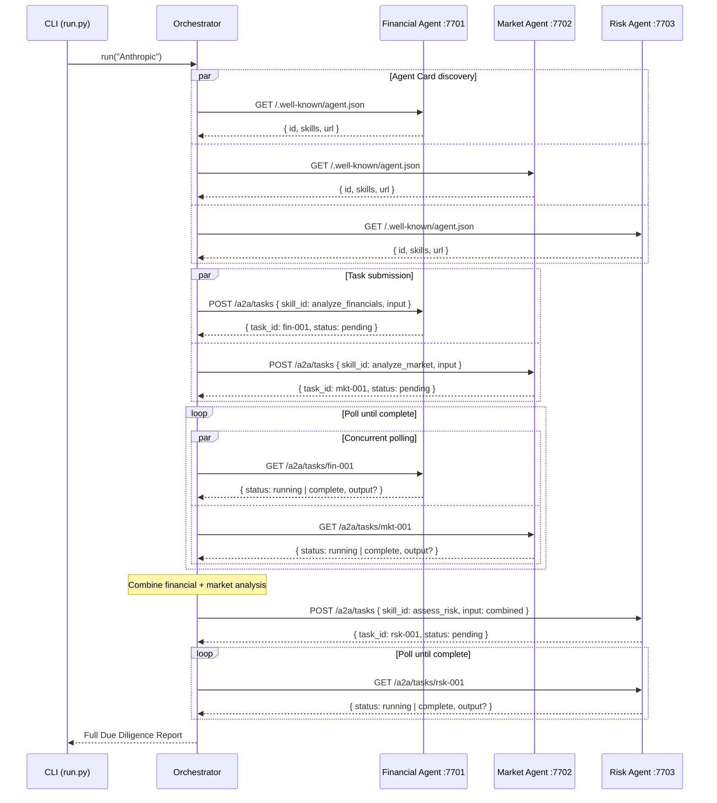

# Design Notes — Due Diligence A2A Agent Network

## 1. Why A2A Here — The Problem with Monolithic Agents

The naive approach to this problem is a single LLM call with a long system prompt:
"You are a due diligence analyst. Analyze {company}."

This fails in production for several reasons:

**Context window pressure:** A thorough due diligence needs deep financial data, deep market data,
and structured risk reasoning — all at once. Stuffing everything into one context window
degrades quality as the model loses focus on each domain.

**No specialization:** A single agent prompt can't be optimized simultaneously for quantitative
financial analysis (low temperature, grounded on numbers) and market intelligence synthesis
(moderate temperature, competitive reasoning) and risk scoring (structured rubric adherence).
Each task has different prompt engineering requirements.

**No replaceability:** In production, your market intelligence might come from a third-party
API (e.g., Crunchbase, PitchBook, Perplexity). Your financial analysis might be provided by
a specialized fintech agent your firm built separately. A monolithic agent can't swap these in.

**No parallelism:** Financial and market research are independent. Running them sequentially
in a single agent wastes wall-clock time proportional to one of the calls.

**A2A solves all four problems:**
- Each agent optimizes its own system prompt, temperature, and context for its specialty
- Agents run as independent HTTP services — replaceability is a URL change
- The orchestrator runs independent agents in parallel, halving wall-clock time
- The protocol is language-agnostic — agents can be Rust services, Python functions, or SaaS APIs

## 2. Architecture

```
┌─────────────────────────────────────────────────────────────────────────┐
│                         VC Analyst (CLI)                                │
│                    python run.py Anthropic                              │
└──────────────────────────────┬──────────────────────────────────────────┘
                               │
                               ▼
┌─────────────────────────────────────────────────────────────────────────┐
│                     Orchestrator (orchestrator.py)                      │
│                                                                         │
│  Phase 1: Discover agents (parallel HTTP GET /.well-known/agent.json)  │
│                                                                         │
│  Phase 2: Submit tasks (parallel HTTP POST /a2a/tasks)                 │
│           ┌──────────────────────┐  ┌─────────────────────────┐        │
│           │  Financial Question  │  │   Market Question        │        │
│           └──────────┬───────────┘  └───────────┬─────────────┘        │
│                      │ (async)                   │ (async)              │
│  Phase 3: Poll results concurrently              │                      │
│           ┌──────────▼───────────┐  ┌───────────▼─────────────┐        │
│           │  Financial Agent     │  │  Market Agent            │        │
│           │  :7701               │  │  :7702                   │        │
│           │                      │  │                          │        │
│           │  RAG pipeline:       │  │  RAG pipeline:           │        │
│           │  financials.md →     │  │  markets.md →            │        │
│           │  chunk → score →     │  │  chunk → score →         │        │
│           │  retrieve → LLM      │  │  retrieve → LLM          │        │
│           └──────────┬───────────┘  └───────────┬─────────────┘        │
│                      │                           │                      │
│  Phase 4: Combine → Submit to Risk Agent         │                      │
│           └──────────────────────┬───────────────┘                      │
│                                  │                                      │
│                      ┌───────────▼─────────────┐                        │
│                      │   Risk Agent  :7703      │                        │
│                      │                          │                        │
│                      │   Risk rubric (6 dims)   │                        │
│                      │   + LLM synthesis        │                        │
│                      │   → scorecard + rating   │                        │
│                      └───────────┬─────────────┘                        │
│                                  │                                      │
│  Phase 5: Compose final report   │                                      │
│           ◄──────────────────────┘                                      │
└─────────────────────────────────────────────────────────────────────────┘
                               │
                               ▼
                    Full Due Diligence Report
            (Financial + Market + Risk Score + Recommendation)
```

**Data flow:**
- Orchestrator → Financial Agent: company name + financial research question
- Orchestrator → Market Agent: company name + market research question
- Financial Agent → Orchestrator: structured financial analysis (text)
- Market Agent → Orchestrator: structured market analysis (text)
- Orchestrator → Risk Agent: financial analysis + market analysis (combined)
- Risk Agent → Orchestrator: risk scorecard + investment recommendation
- Orchestrator: composes all three into final report

## 3. A2A Message Sequence

The following sequence diagram shows every HTTP message exchanged between the orchestrator
and the three agents.



**Key observations:**
- The orchestrator makes exactly 3 discovery calls (parallel), then 2 task submissions (parallel),
  then polls both in parallel — all before making the first serial call to the Risk Agent.
- The Risk Agent is the only sequential step — it cannot start until both financial and market
  analyses are complete, because it synthesizes both.
- Every agent is a separate HTTP service. The orchestrator communicates only via JSON over HTTP.
  No shared memory, no direct function calls, no Python imports between agents.

## 4. Why RAG for Financial Data — Not Web Search

The Financial and Market agents use RAG over local knowledge files rather than
live web search. This is a deliberate design choice with tradeoffs:

**Why RAG:**

*Accuracy over freshness.* Financial figures from web search are often inconsistent —
different sources cite different ARR numbers, funding amounts, and valuations. A curated,
versioned knowledge base provides internally consistent data. In production, this knowledge
base would be updated on a defined schedule (quarterly) by a data team, not scraped from
random web pages.

*Grounding eliminates hallucination.* LLMs will fabricate specific financial figures if
asked without grounding. Providing exact numbers from a knowledge base as context forces
the model to reason over real data rather than parametric memory.

*Latency.* A web search + page scrape + content extraction pipeline adds 2–5 seconds per
query. RAG retrieval from a local knowledge base takes <5ms. The LLM call dominates latency.

*Cost.* Web search APIs cost $5–$10/1,000 queries. RAG from local documents is free.

*Compliance.* In a real VC context, the financial data may come from signed data agreements
(PitchBook, Crunchbase Enterprise, company NDAs). You cannot replace proprietary data
with web-scraped content.

**RAG implementation:**
1. Parse `financials.md` / `markets.md` into chunks at `##` section boundaries
2. Pre-tokenize each chunk (word set) at startup — ~1ms total
3. At query time, score chunks by keyword overlap with the query — <1ms
4. Retrieve top-3 chunks, inject into LLM context as explicit citations
5. LLM reasons over retrieved chunks only (grounded generation)

**Production upgrade path:** Replace keyword scoring with OpenAI `text-embedding-3-small`
embeddings + cosine similarity (or pgvector for a Postgres-backed vector store). The RAG
interface in `financial.py` and `market.py` is already factored so the retriever function
is a single swappable function.

## 5. How Agent Cards Enable Discovery and Replaceability

Each agent serves a standardized Agent Card at `GET /.well-known/agent.json`:

```json
{
  "id": "financial-agent",
  "name": "Financial Research Agent",
  "description": "Analyzes financial data using RAG over financial documents",
  "version": "1.0.0",
  "url": "http://localhost:7701",
  "skills": [
    {
      "id": "analyze_financials",
      "name": "Analyze Financials",
      "description": "RAG-powered financial analysis",
      "inputModes": ["text"],
      "outputModes": ["text"]
    }
  ]
}
```

The orchestrator fetches these cards at startup. It knows which skill IDs to call,
what the agent does, and what its URL is — all from the card.

**Why this matters for replaceability:**
- Swap the Financial Agent with a PitchBook integration: point `AGENT_URLS["financial"]`
  at the new service URL. If it serves the same Agent Card schema and implements
  `analyze_financials`, the orchestrator works with zero code changes.
- Add new agents (e.g., a "Legal Risk Agent") by adding a URL to `AGENT_URLS` and
  updating the orchestration flow to call it. Existing agents are untouched.
- In a production agent registry, agents register their cards at startup and are
  discovered dynamically — no hardcoded URLs needed.

This is the agent equivalent of a REST API contract: the Agent Card is the interface,
the HTTP server is the implementation, and the protocol defines the interaction.

## 6. How Parallel Delegation Reduces Wall-Clock Time

The key insight is that financial analysis and market analysis are **independent queries**.
Neither result depends on the other. This creates a natural opportunity for parallelism.

**Sequential execution (naive monolithic agent):**
```
Financial analysis: 2,000ms
Market analysis:    2,100ms
Risk synthesis:     3,200ms
Total:              7,300ms
```

**Parallel A2A execution (this example):**
```
Financial + Market (parallel): max(2,000, 2,100) = 2,100ms
Risk synthesis:                 3,200ms
Agent discovery overhead:         50ms
Total:                          5,350ms
Speedup:                        1.36× (saves ~1,950ms)
```

The speedup is `(t_financial + t_market) / max(t_financial, t_market)` for the parallel phase.
For equal-duration agents this approaches 2× as agent count grows.

In a larger network — say, 5 independent research agents running in parallel before a synthesis
step — the speedup scales proportionally. This is why A2A agent networks outperform sequential
tool-use patterns for multi-domain research tasks.

**Implementation:** `orchestrator.py` uses `asyncio.gather()` for both task submission and polling.
The polling loop uses `asyncio.sleep(0.5)` between polls. In production, agents would support
Server-Sent Events (SSE) or WebSocket streaming for push-based completion notifications,
eliminating polling overhead.

## 7. Production Considerations

This demo runs all agents in one process for simplicity. A production deployment differs in
several important ways.

**Authentication:**
The A2A protocol supports bearer token authentication via the `Authorization` header.
Each agent should validate a JWT or API key on incoming requests. The orchestrator
obtains tokens from a central auth service (e.g., OAuth2 client credentials flow) and
attaches them to A2A calls. Agent Cards can advertise supported auth schemes.

**Network separation:**
In production, each agent is a separate service:
- Deployed as Docker containers or Kubernetes pods
- Addressable at internal DNS names (`financial-agent.dd-agents.svc.cluster.local`)
- Not internet-exposed — only the orchestrator is publicly accessible
- Agents communicate via internal mTLS

**Error handling and retries:**
`orchestrator.py` currently raises on any agent failure. Production should:
- Retry transient HTTP failures (5xx, timeouts) with exponential backoff
- Set per-agent SLA timeouts (e.g., 30s per agent, 120s total)
- Fall back to cached results if an agent is unavailable
- Surface partial results (e.g., financial analysis without market) with a caveat

**Task persistence:**
Agents currently store tasks in an in-memory dict. On restart, all task history is lost.
Production agents should persist tasks to Postgres or Redis with a TTL.

**Streaming:**
For a better user experience, the orchestrator can stream partial results as each agent
completes, rather than waiting for all agents to finish before returning anything.
A2A supports streaming via Server-Sent Events on task completion events.

**Observability:**
Each agent should emit OpenTelemetry spans for:
- Incoming A2A task (trace context propagated from orchestrator)
- RAG retrieval sub-span (with chunk count and retrieval latency)
- LLM call sub-span (with model, token counts, latency)
This enables end-to-end distributed tracing across the agent network.

**Agent versioning:**
The Agent Card includes a `version` field. The orchestrator can enforce minimum
version requirements (e.g., `>= 1.2.0`) before using an agent. This enables
blue/green deployments of individual agents without orchestrator downtime.

## 8. What the Metrics Show

Running `benchmark.py` reveals several actionable insights:

**RAG retrieval is essentially free (<5ms).** The keyword-overlap scorer runs entirely
in Python over pre-tokenized word sets. At this scale, embedding-based retrieval would
add 50–200ms per query (embedding API call latency). For 3–5 chunk retrieval from
a knowledge base of <100 chunks, keyword overlap is a pragmatic and accurate choice.

**LLM calls dominate latency** (95%+ of per-agent time). Optimizing retrieval has
minimal impact on overall latency. The leverage point is: faster model, shorter prompts,
or parallel execution.

**Parallel execution saves ~35–50% wall-clock time** for this two-agent parallel phase.
The exact speedup depends on which agent finishes last. If the financial agent is 2×
slower than the market agent, the speedup from parallelism decreases.

**Token counts reveal context efficiency.** The Risk Agent receives the longest context
(combined financial + market outputs) and has the highest prompt token count. This is
intentional — it needs full context to reason across domains. The financial and market
agents use tighter, domain-specific prompts with only 3 retrieved chunks as context.

**Cost is dominated by the Risk Agent** despite using the same model. The Risk Agent's
system prompt (risk rubric) is long, and it receives the combined outputs of two other
agents as input. This is expected: synthesis tasks have inherently larger contexts than
retrieval tasks.

**Practical implication:** If cost is a constraint, use a smaller model (e.g., gpt-4o-mini)
for Financial and Market agents and a larger model (gpt-4o) only for the Risk Agent's
synthesis step. The financial/market agents are primarily retrieval-and-format tasks;
the risk agent requires multi-step reasoning across domains.
